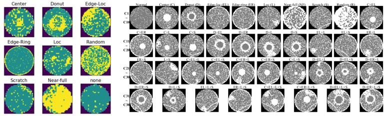

## Semi-Supervised Domain Adaptation for Wafer Map Defect

Since our paper has not yet been published, we are only sharing a portion of the code related to this work. The complete code requires further refinement and will be made publicly available in the future. Stay tuned.

### 1. Requirements
Before running the code, you need to install the required environment dependencies. Our code primarily relies on torch 2.0.1.

```shell
pip install -r requirements.txt
```

### 2. Data Preparation
The datasets used in this paper are [WM-811K](https://www.kaggle.com/datasets/qingyi/wm811k-wafer-map) and [MixedWM38](https://github.com/Junliangwangdhu/WaferMap).




The images above show WM-811K and MixedWM38, respectively. Before using the data, all images need to be resized to 64x64. Then, the data should be converted to '.npy' format, and the file paths should be updated in the 'get_dataset' function in 'utils_.py' by replacing the paths with the storage locations of the datasets.

### 3. Training

We use ResNet34 as the default backbone. If working with the Wafer Map dataset, the default parameter values can be selected. To run the model:

```shell
# python train.py -d wm -a resnet34 --epochs 20 -i 500
```

In this case, '-d' represents the data, '-a' specifies the backbone model to be used, '--epoch' sets the number of training epochs, and '-i' defines the number of iterations per epoch.

After the execution, the model will print the results for ACC (Accuracy), F1, Precision, and Recall.
### Acknowledgment

The code is partly based on [*TLlib*](https://github.com/thuml/Transfer-Learning-Library)

